# Лабораторная работа по оптимизации поиска в хеш-таблице (отформатирован не до конца)

# 1. Цель работы

Написать библиотеку для работы с хеш-таблицей.
Провести анализ распределения различных хеш-функций.
Оптимизировать процесс поиска с использованием `intrinsic`, `inline asm`, и функции на `asm`.

# 2. Описание алгоритма

## 2.1 Определение

Хеш-таблица — это структура данных, реализующая ассоциативный массив, в которой каждому ключу сопоставляется индекс корзины с помощью хеш-функции.

## 2.2 Хеш-функция

Хеш-функция $h(x)$ преобразует ключ $x$ в индекс ячейки таблицы:

* $i = h(x) \mod N$,

где $N$ — размер таблицы.

Качество хеш-функции определяется равномерностью распределения значений по ячейки: чем меньше дисперсия длин списков, тем меньше ожидаемое время поиска.

## 2.3 Разрешение коллизий

При совпадении хеш-значений разных ключей возникает коллизия. В данной работе для её разрешения используется метод цепочек: каждая ячейка хранит односвязный список элементов с одинаковым хешем.

Поиск элемента сводится к вычислению хеша, переходу к нужной ячейке и линейному обходу списка с посимвольным сравнением ключей.

# 3. Формулировка задачи

Необходимо реализовать хеш-таблицу для текстовых данных.
Провести сравнения распределения различных хеш-функций:

* Константа
* ASCII код первой буквы
* Длина слова
* Сумма ASCII кодов (на 2 таблицах различного размера)
* `rol` и `ror`
* Своя хеш-функция
* `crc32`

Измерить производительность операции поиска при многократных обращениях.
Оптимизировать поиск следующими способами:

* (опционально) C - оптимизация
* (опционально) Архитектурная оптимизация
* `inline asm`
* `intrinsic`
* Функция на `asm`

Произвести измерения производительности на каждом этапе измерений и провести сравнительный анализ.

# 4. Методика измерений

Тестовая машина: `Lenovo IdeaPad Slim 5 16ABR8`, операционная система: `CachyOS` на ядре `Arch Linux`.

Для определения времени работы алгоритма используется функция `__rdtsc()`, возвращающая значение счетчика `TSC (Time Stamp Counter)`.

Несмотря на то, что по сути она является ассемблерной инструкцией, её работа также занимает несколько тиков процессора, поэтому в процессе измерения её вызов происходил для измерения времени много больше, чем может занимать её вызов.

Для устранения шумов были использованы следующие методики:

* Изоляция процесса на определённых ядрах.
* Неизменные характеристики внешней среды.
* Большое количество тестов.

## 4.1 Изоляция процесса

Измерение времени через `__rdtsc` несёт следующую проблему: если во время выполнения программы ядро операционной системы сменит наш процесс на другой, зафиксировать это не выйдет.
Из-за этого счётчик `TSC` будет показывать некорректные значения.

Для устранения этих проблем для тестирования программы было выделено два потока одного ядра тестовой машины.

* В конфигурационных файлах загрузчика операционной системы из свободных для распределителя потоков ядер были убраны `14` и `15` потоки.
* Тестовая машина была перезагружена.
* Программа запускалась именно на `14` и `15` потоке через функцию `taskset -c 14,15`.

Благодаря такой методике из измерений были убраны шумы, связанные с работой внешних программ, но системные процессы всё равно могли запускаться на выделенных потоках.
В этой работе это не было учтено.

## 4.2 Тесты программы

В каждой реализации измерялось время выполнения большого количества операций поиска (около 18 тыс. слов). Данными для поиска послужили слова из книги `The Lord of the Rings`.
Для устранения случайных выбросов производилось многократное повторение замеров (~ `10000`) с последующим усреднением и оценкой среднеквадратичного отклонения.

# 5. Измерения

## 5.1 Анализ распределения хеш-функций

Для каждой функции была построена гистограммах распределения слов по ячейкам.
В качестве собственной функции использовался `gnu hash`.

Константная хеш-функция.
[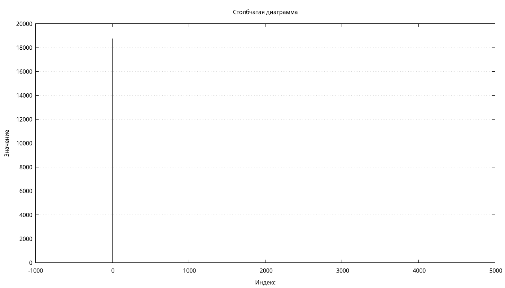](HashRes/Const/bars.png)

ASCII код первой буквы.
[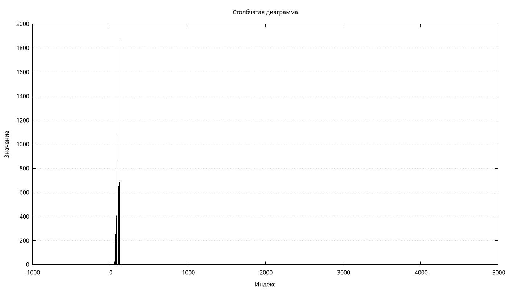](HashRes/FirstASCII/bars.png)

Длина слова.
[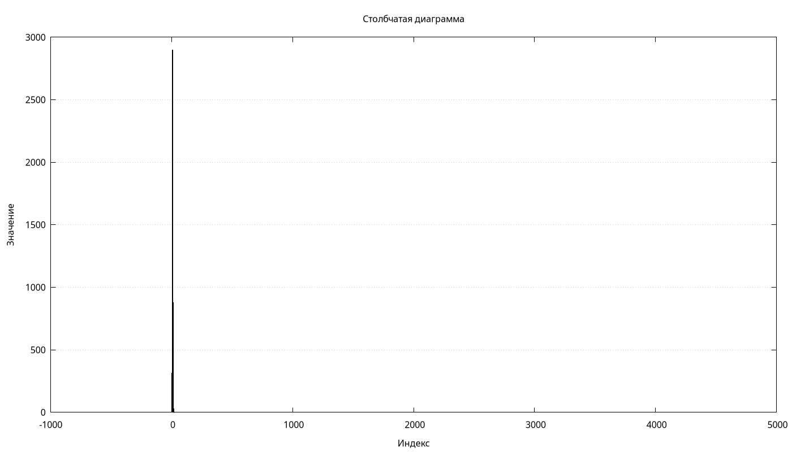](HashRes/Len/bars.png)

Сумма ASCII кодов, размер таблицы - 500.
[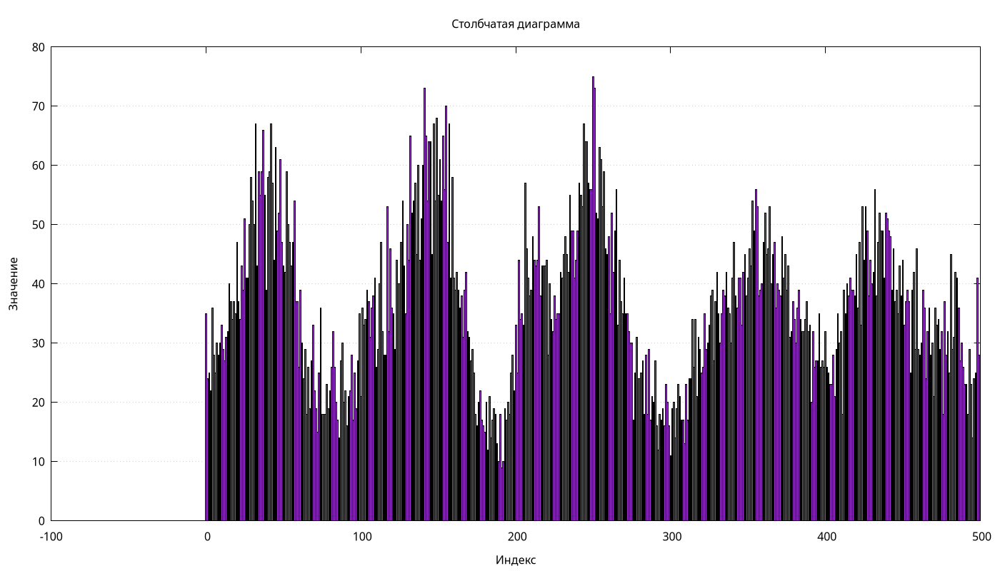](HashRes/Sum500/bars.png)

Сумма ASCII кодов, размер таблицы - 5000.
[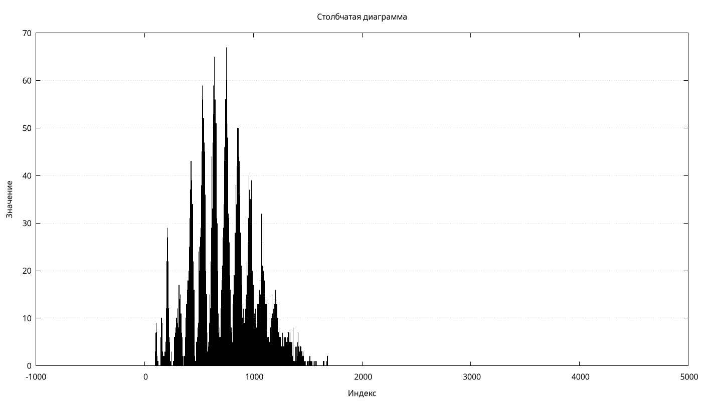](HashRes/Sum5000/bars.png)

`rol`.
[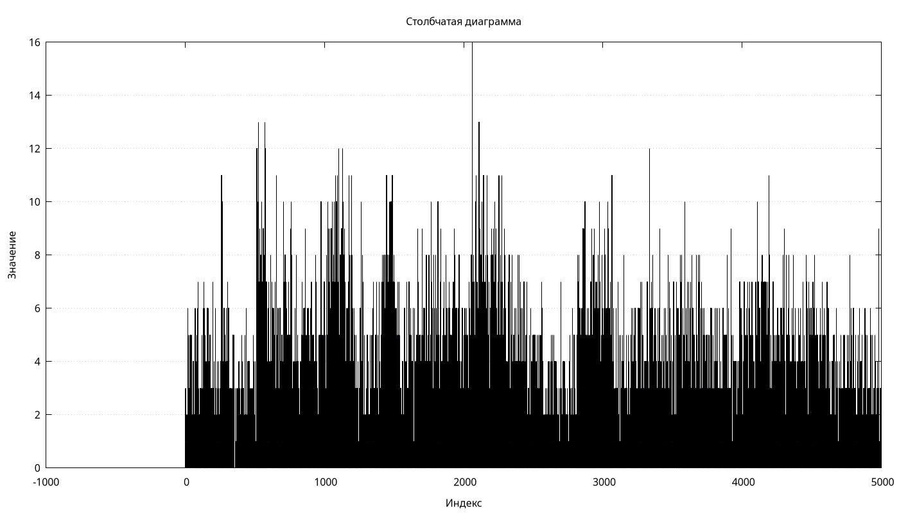](HashRes/RolLeft/bars.png)

`ror`.
[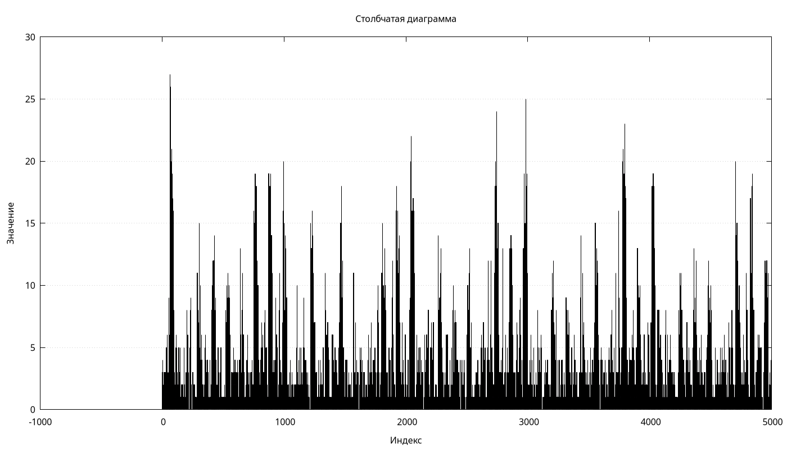](HashRes/RolRight/bars.png)

Своя функция.
[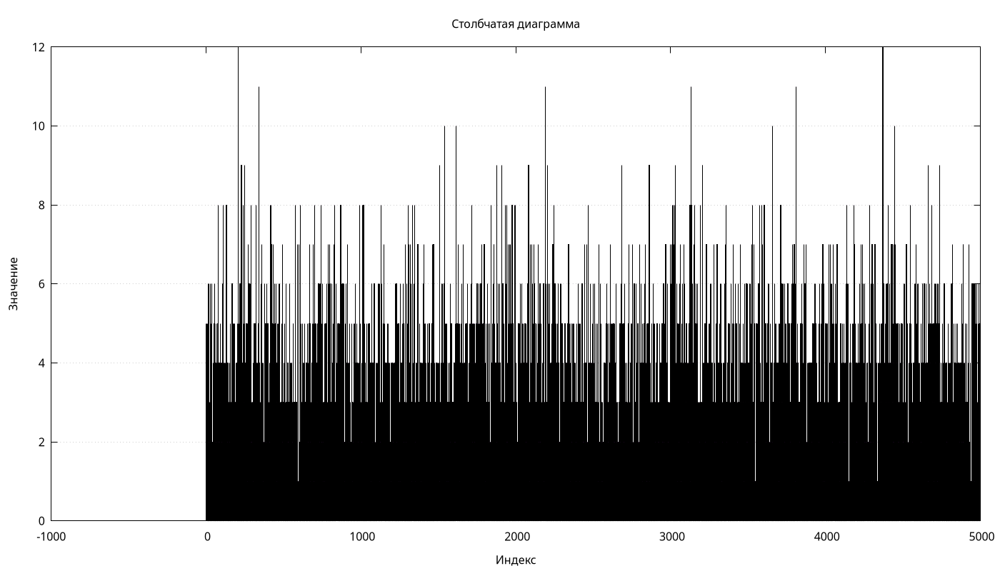](HashRes/Fast/bars.png)

`crc32`.
[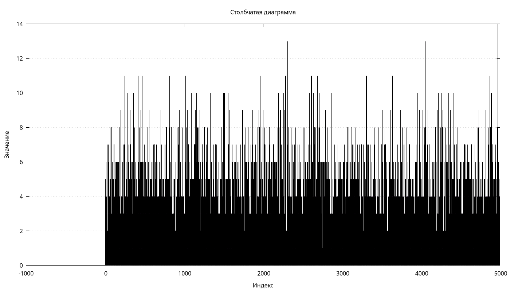](HashRes/CRC32/bars.png)

На графиках видно, что распределения сильно отличаются.
Для более наглядного сравнения былоа построена гистограмма со средним количеством слов в несвободной ячейке и дисперсия этого значения (`fast` = `own`).
[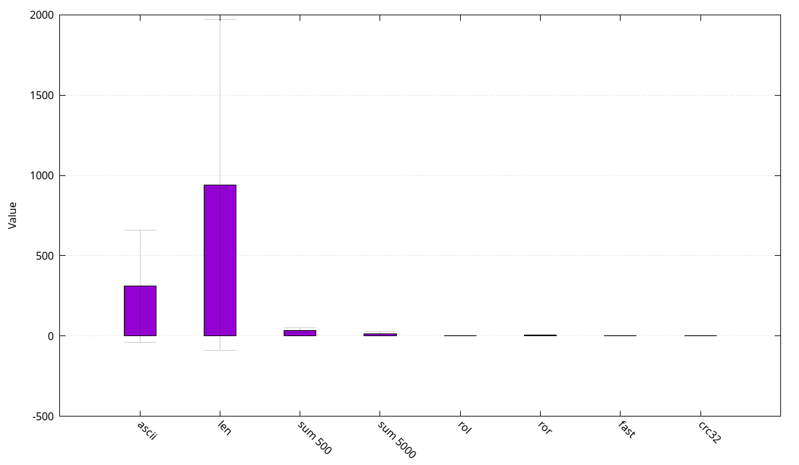](hash_cmp_1.png)

Без длины и ASCII кода.
[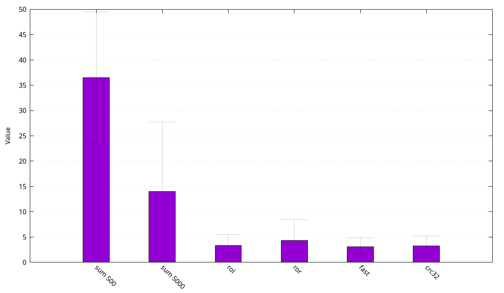](hash_cmp_2.png)

Видно, что преимущество у `crc32` и `fast`, которой является `gnu hash`.
В дальнейшем именно эти функции и использовались в поиске.

## 5.2 Общая оптимизация поиска

| Реализация | Время, циклы $\cdot 10^6$ | Ускорение относительно предыдущей наибыстрейшей реализации | Итоговое ускорение |
| --- | --- | --- | --- |
| Без оптимизаций | $28.0 \pm 0.2$ | $1.0$ | $1.0$ |
| Без указателей на функцию | $28.0 \pm 0.1$ | $1.0$ | $1.0$ |
| С оптимизацией strcmp | $23.0 \pm 0.1$ | $1.22$ | $1.22$ |
| С intrinsic хеш-функцией | $23.80 \pm 0.15$ | $0.99$ | $1.18$ |
| С быстрым хеш (без inline asm) | $20.8 \pm 0.1$ | $1.11$ | $1.35$ |
| С быстрым хеш (с inline asm) | $20.7 \pm 0.1$ | $1.0$ | $1.35$ |
| C PGO | $19.40 \pm 0.07$ | $1.07$ | $1.44$ |
| С увеличенным размером (5000 -> 18000) | $17.40 \pm 0.08$ | $1.11$ | $1.61$ |
| Без хеша в списках | $15.04 \pm 0.06$ | $1.16$ | $1.86$ |
| С раскрытым циклом хеша | $14.86 \pm 0.05$ | $1.01$ | $1.88$ |
| Компиляция clang | $13.74 \pm 0.06$ | $1.08$ | $2.04$ |

Все измерения производились с флагами для максимальной производительности: `-O3 -flto=thin -ffast-math -DN_DEBUG -mavx -mavx2`.

Программа без оптимизаций.
[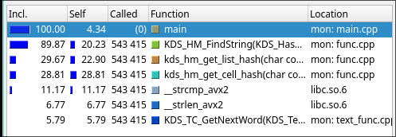](Img/1.png)

Убраны указатели на функции.
[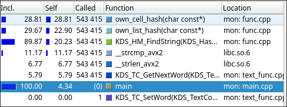](Img/2.png)

Хеш-функция на интринсиках.
[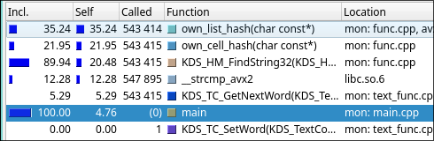](Img/3.png)

Более простая хеш-функция.
[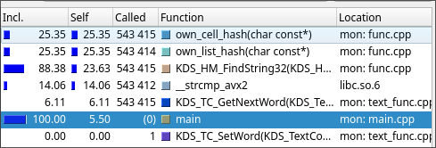](Img/4.png)

С оптимизированным `strcmp`.
[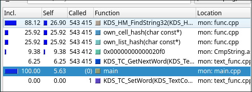](Img/5.png)

C `inline-asm` в одной хеш-функции.
[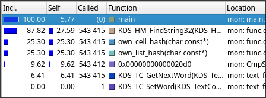](Img/6.png)

C `PGO`.
[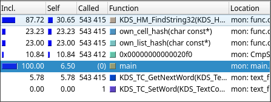](Img/7.png)

С увеличенным размером.
[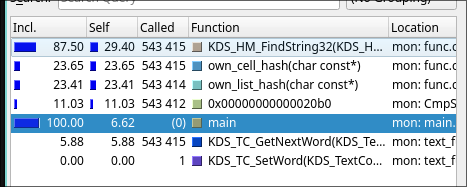](Img/8.png)

Без хеширования списков.
[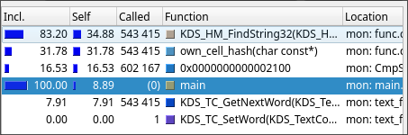](Img/9.png)

Развёрнутый цикл.
[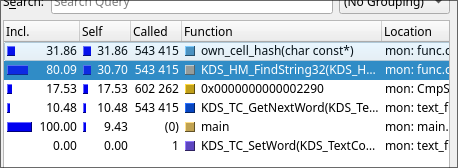](Img/10.png)

## 5.3 Использование `intrinsic` и `inline asm`

В учебных целях алгоритм поиска был ухудшен, чтобы в дальнейшем было пространство для оставшихся оптимизаций.

Начальная версия на этом этапе.
[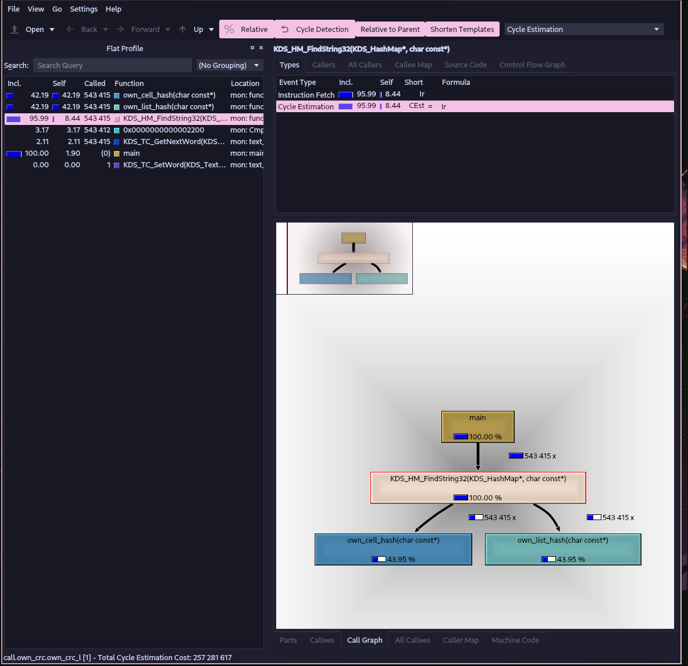](Img/asm_1.png)

С использованием `intrinsic`.
[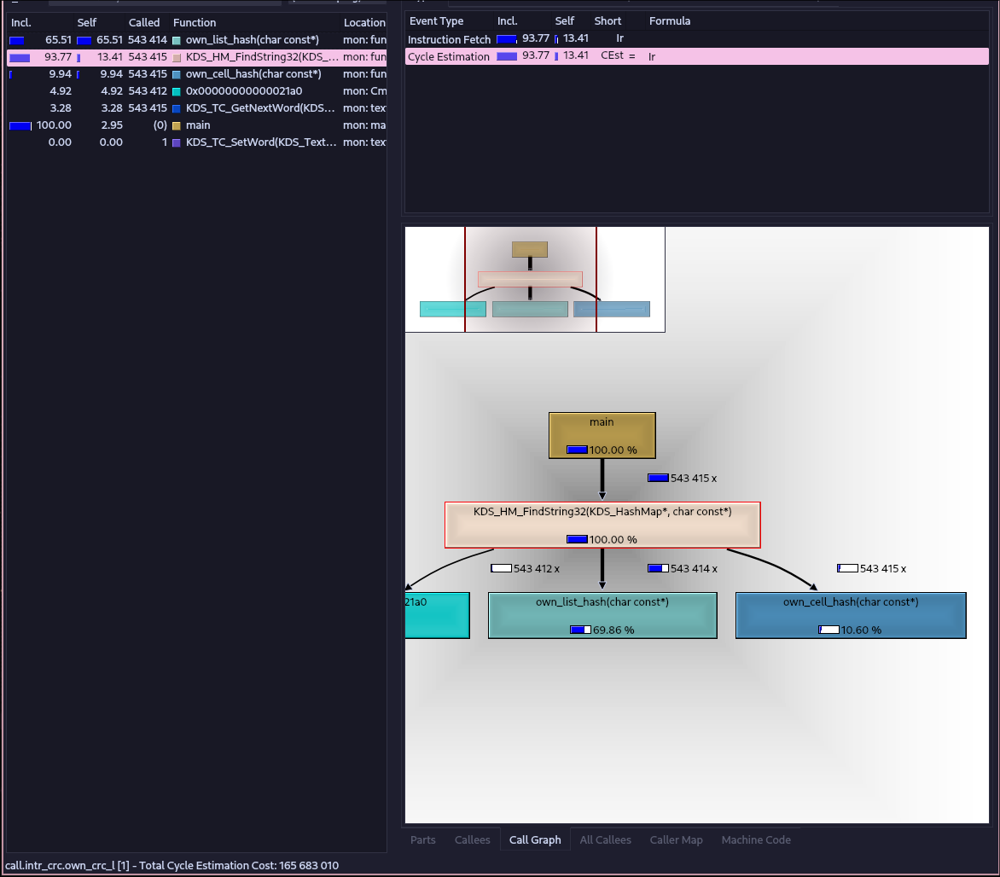](Img/asm_2.png)

С использованием `inline asm`.
[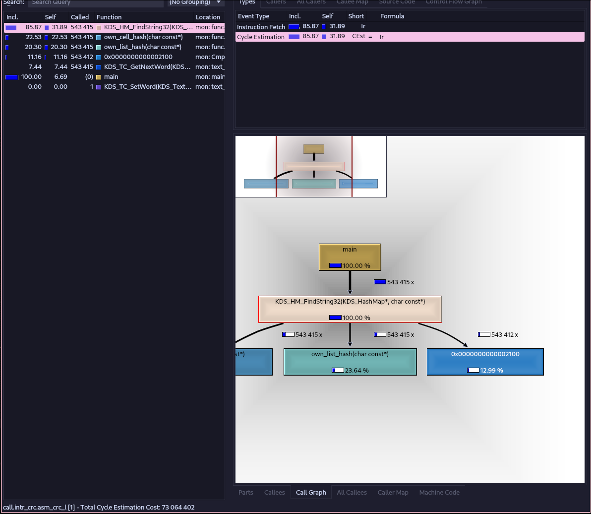](Img/asm_3.png)

# 6. Анализ результатов

Видно, что последовательное применение оптимизаций даёт итоговое ускорение примерно в `2.04` раза по сравнению с базовой реализацией.

Наиболее эффективными оказались следующие шаги:

* Замена `strcmp` на ассемблерную реализацию ($+22\%$). Это связано с тем, что библиотечный `strcmp` в каждом вызове производит проверки, а ассемблерная функция реализована без циклов и минимальным количеством условных переходов.
* Замена тяжёлой хеш-функции на простую и быструю ($+11\%$). Тяжёлая хеш-функция давала распределение не сильно лучше, и выигрыш от равномерности ячеек не покрывал стоимости её вычисления.
* Увеличение размера таблицы ($+11\%$). Уменьшается средняя длина списка в ячейке и, как следствие, число сравнений ключей.
* Отказ от повторного хеширования внутри списков ($+16\%$). Хранение хеша рядом с ключом не оправдалось — линейный обход списка оказался дешевле.
* Компиляция `clang` дала дополнительные $8\%$ — возможно, за счёт более удачного раскрытия циклов и инлайнинга по сравнению с `gcc`.

Отдельно стоит отметить, что попытки использовать `intrinsic` и `inline asm` для основной хеш-функции не дали ускорения относительно чистого C: компилятор справлялся не хуже ручной реализации.
Поэтому в конечную реализацию из «ручных» оптимизаций попала только функция на `asm`, заменяющая `strcmp` — единственное место, где ручной код стабильно обгонял компилятор.

